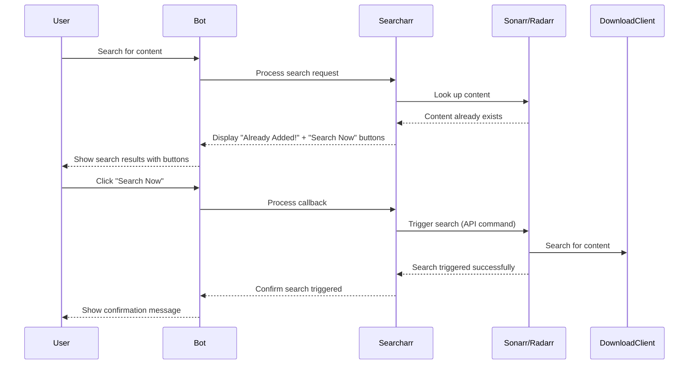

# Feature Implementation Plan: Add "Search Now" Button for Already Added Content

## Overview
When a user searches for content (TV show or movie) that's already added to Sonarr or Radarr, we'll add a "Search Now" button next to the "Already Added!" button. This will allow users to trigger a search for the content on the respective service, initiating the download process.

## Technical Analysis

### Current Implementation
Currently, when content is already added:
1. The system displays an "Already Added!" button that doesn't perform any action (it's linked to a "noop" operation)
2. There's no way to trigger a search for existing content directly from the Telegram bot

### Required Changes

#### 1. Add Search Methods to API Wrappers

We need to add methods to both the Sonarr and Radarr classes to trigger searches for existing content:

**For Sonarr (sonarr.py):**
```python
def search_series(self, series_id):
    """Trigger a search for an existing series by its ID."""
    params = {
        "name": "SeriesSearch",
        "seriesId": series_id
    }
    return self._api_post("command", params)
```

**For Radarr (radarr.py):**
```python
def search_movie(self, movie_id):
    """Trigger a search for an existing movie by its ID."""
    params = {
        "name": "MovieSearch",
        "movieId": movie_id
    }
    return self._api_post("command", params)
```

#### 2. Modify the UI to Add the "Search Now" Button

In searcharr.py, we need to modify the `_prepare_response` method to add a "Search Now" button next to the "Already Added!" button when content is already in the library.

Current implementation (around line 1564):
```python
else:
    keyboardActRow.append(
        InlineKeyboardButton(
            self._xlate("already_added_button"),
            callback_data=f"{cid}^^^{i}^^^noop",
        ),
    )
```

Modified implementation:
```python
else:
    keyboardActRow.append(
        InlineKeyboardButton(
            self._xlate("already_added_button"),
            callback_data=f"{cid}^^^{i}^^^noop",
        ),
    )
    keyboardActRow.append(
        InlineKeyboardButton(
            self._xlate("search_now_button"),
            callback_data=f"{cid}^^^{i}^^^search",
        ),
    )
```

#### 3. Add a New Operation in the Callback Handler

In the `callback` method of the Searcharr class, we need to add a new operation to handle the "search" action:

```python
elif op == "search":
    r = convo["results"][i]
    if convo["type"] == "series" and r["id"]:
        result = self.sonarr.search_series(r["id"])
        if result:
            query.message.reply_text(self._xlate("search_triggered", kind=self._xlate("series").title()))
        else:
            query.message.reply_text(self._xlate("search_failed", kind=self._xlate("series").title()))
    elif convo["type"] == "movie" and r["id"]:
        result = self.radarr.search_movie(r["id"])
        if result:
            query.message.reply_text(self._xlate("search_triggered", kind=self._xlate("movie").title()))
        else:
            query.message.reply_text(self._xlate("search_failed", kind=self._xlate("movie").title()))
    else:
        query.message.reply_text(self._xlate("search_not_supported"))
```

#### 4. Add New Translation Strings

We need to add new translation strings to the language files:

```yaml
search_now_button: "🔍 Search Now"
search_triggered: "{kind} search triggered! Check your download client for progress."
search_failed: "Failed to trigger {kind} search. Please check logs."
search_not_supported: "Search is not supported for this content type."
```

## Implementation Steps

1. Add the search methods to the Sonarr and Radarr classes
2. Modify the `_prepare_response` method to add the "Search Now" button
3. Add the new operation in the callback handler
4. Add the new translation strings to the language files (at least to en-us.yml)
5. Test the implementation

## Flow Diagram



## Considerations

1. **Error Handling**: We need to handle potential API errors when triggering searches
2. **User Feedback**: Provide clear feedback to users about the search status
3. **Permissions**: Ensure that only authenticated users can trigger searches
4. **Rate Limiting**: Consider implementing rate limiting to prevent abuse